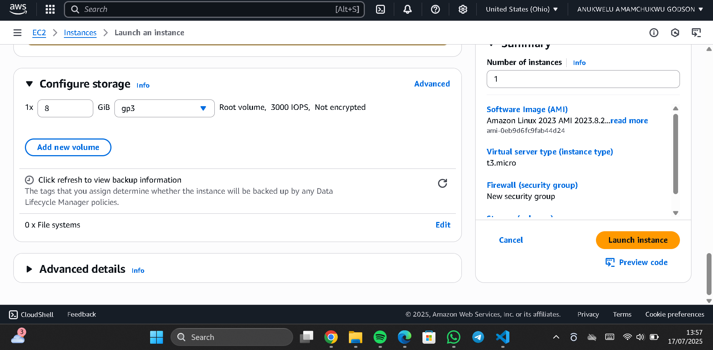
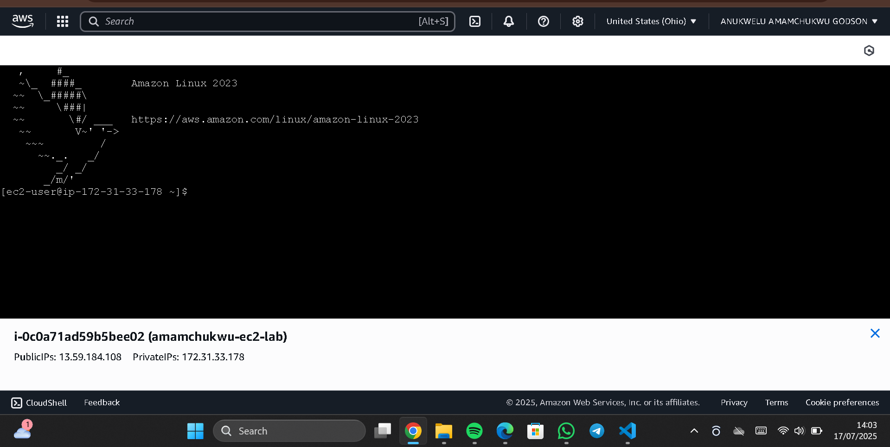
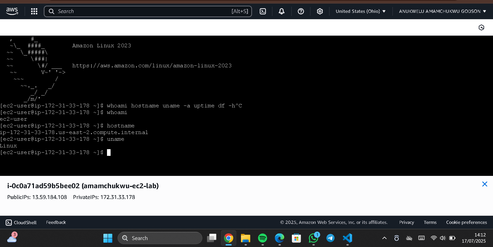
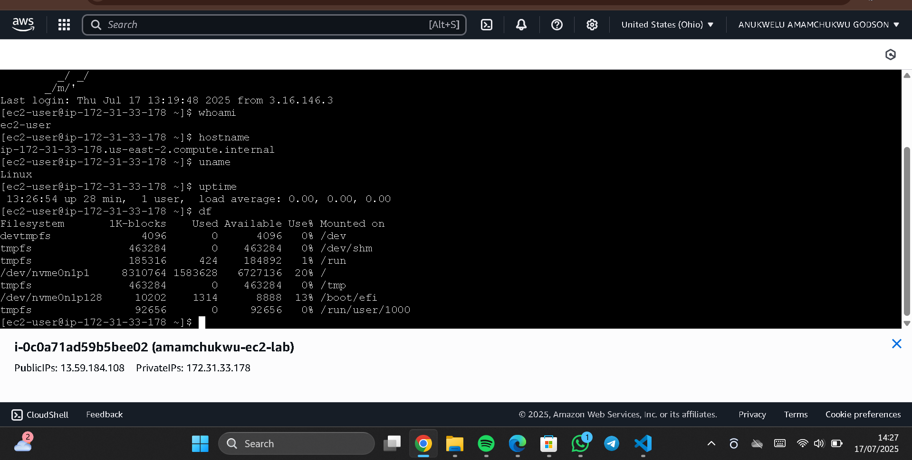
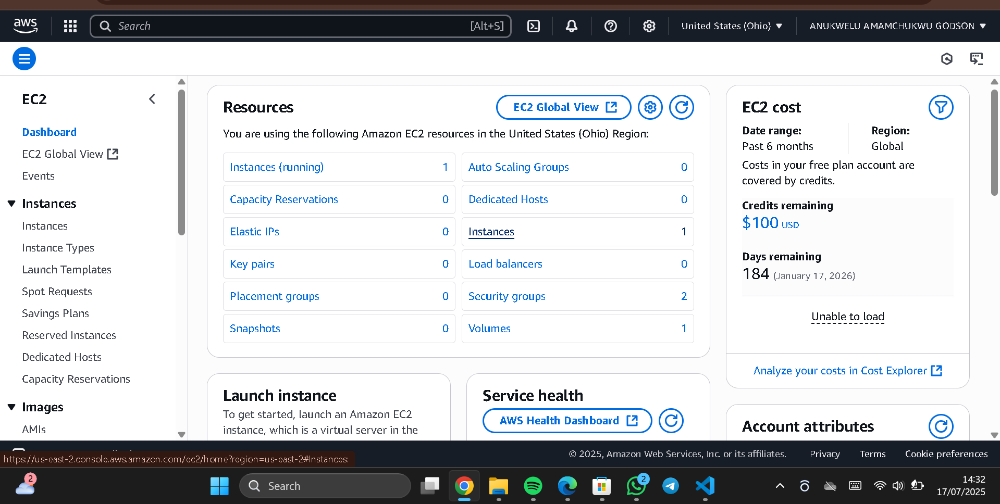

#  AWS Cloud Practitioner Lab Project

This project demonstrates hands-on foundational experience using Amazon Web Services (AWS), focusing on two key services: *Amazon S3* and *EC2 (Elastic Compute Cloud)*. The goal is to simulate basic cloud service operations — creating, configuring, accessing, and managing resources — all through the AWS Console and EC2 Linux instance.

##  Step-by-Step Execution

### 1️⃣ AWS Account Creation and Console Access

Created a free-tier AWS account and logged in to the AWS Console successfully.

Screenshot:  

### 2️⃣ Navigating the AWS Console

Explored the AWS Console to identify available services such as S3, EC2, IAM, and more.

Screenshot:  

### 3️⃣ S3 Bucket Creation

Created an Amazon S3 bucket with default settings (block public access, SSE encryption). This was done in preparation for storing cloud data securely.

 Screenshot of the configuration page:  

 Screenshot of successful bucket creation:  

### 4️⃣ EC2 Instance Launch

Launched a free-tier Amazon EC2 instance using *Amazon Linux 2 AMI*, with:
- t2.micro instance type
- Default VPC and subnet
- Auto-generated key pair
- Security group allowing SSH (port 22)

Screenshot:  

 Screenshot of running instance:  

### 5️⃣ Connecting to EC2 via Web Terminal

Used the EC2 *Connect* feature (browser terminal) to access the Linux terminal.

Screenshot:  

### 6️⃣ Running Linux Commands

Executed basic Linux diagnostic commands to understand the EC2 environment:

| Command | Purpose |
|--------|---------|
| whoami | Shows current user |
| hostname | Displays machine name |
| uname | Kernel/system details |
| uptime | Shows system running time |
| df | Disk space usage |

 Screenshots:
- whoami: 
- hostname: 
- uname: 
- uptime: 
- df: 

### 7️⃣ EC2 Termination

After usage, the EC2 instance was *terminated* to avoid AWS charges.

Screenshot:  

##  What I Learned

- ✅ Creating and configuring cloud resources on AWS
- ✅ Understanding how S3 and EC2 work at a beginner level
- ✅ Navigating cloud service dashboards
- ✅ Running basic terminal commands in a real Linux environment
- ✅ Practicing cost-saving cleanup (terminating instances)

---

##  Author

- *Project Execution*: [Anukwelu Amamachukwu Godson]

## Acknowledgment

This project was carried out through the AWS Skill Builder training platform as part of my foundational cloud computing journey. Special thanks to the AWS Cloud Practitioner Lab for providing a hands-on, practical learning experience.

##  Note

> Always remember to *terminate your EC2 instances and delete unused resources* to avoid unnecessary AWS billing.

