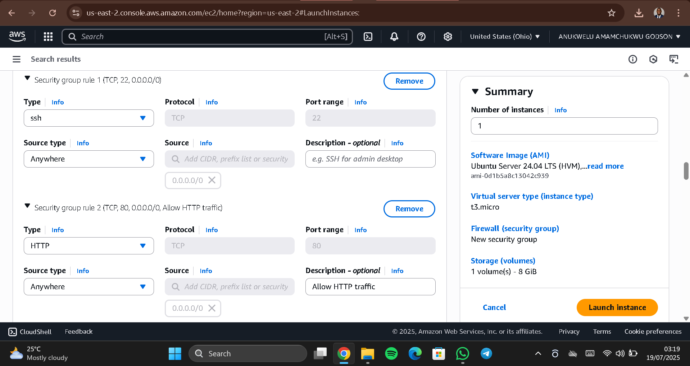
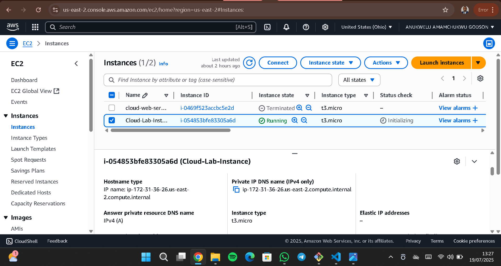
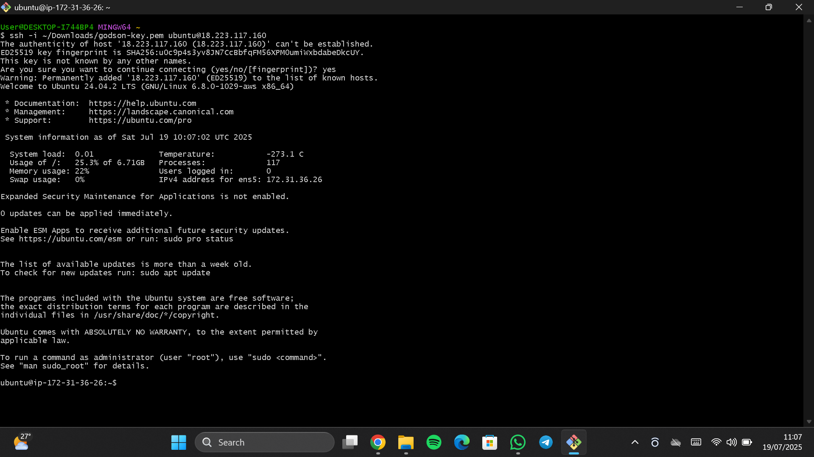
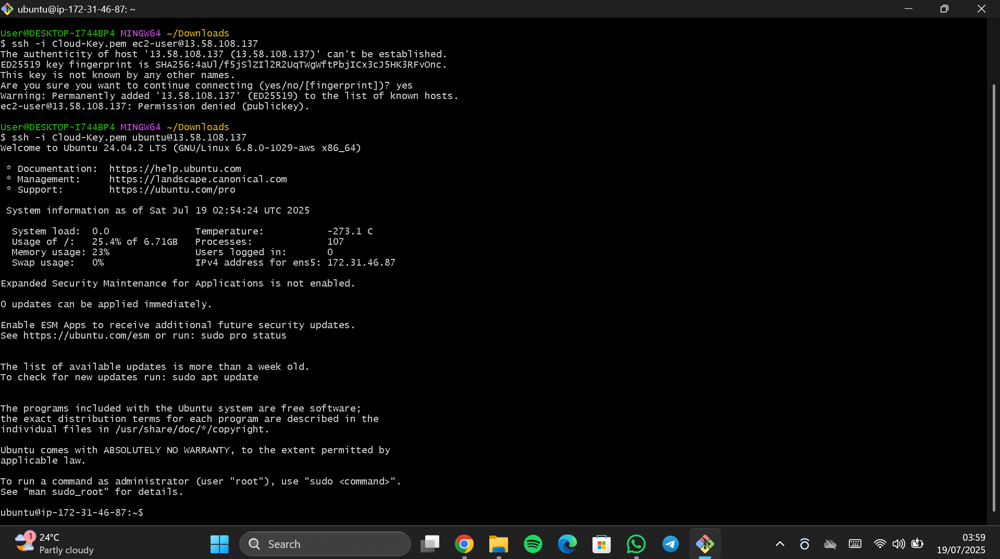
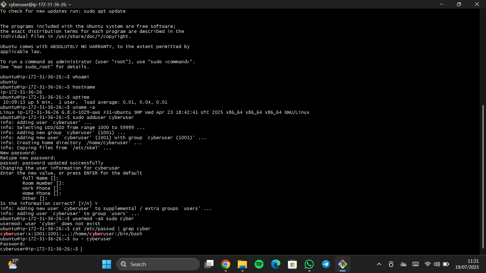
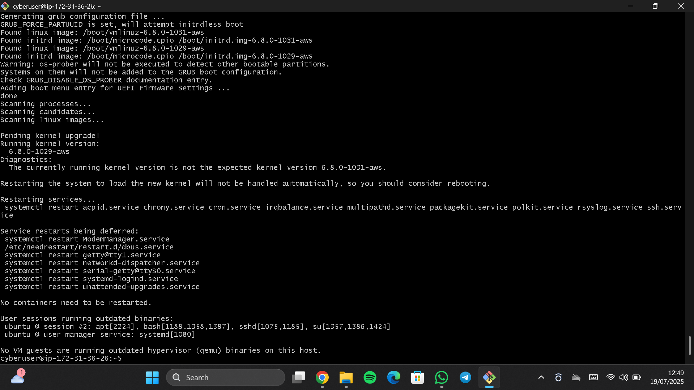
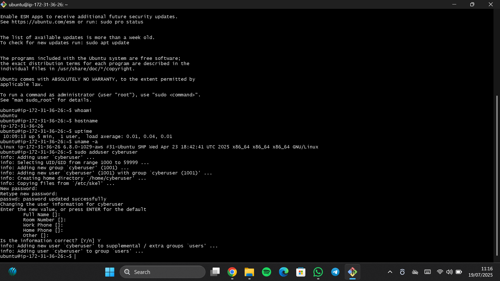

# Cloud Computing Project (Offline Execution)

This project demonstrates *hands-on foundational cloud computing skills* without using direct cloud hosting platforms like GCP or Azure during deployment. Instead, it simulates real-world virtualization concepts, cloud management processes, and local execution of key system diagnostics and security principles—focusing primarily on AWS Cloud concepts, EC2 instance setup, and essential command-line tools.


##  Folder Structure

Project folder: Cloud Computing Project

All screenshots are stored in the screenshots/ subfolder.


##  Project Objective

To show practical understanding of cloud computing services—particularly *Amazon EC2—by launching a virtual server, running system diagnostics, and analyzing server environment information, **while documenting everything for learning and recruitment demonstration*.


##  Tools & Skills Demonstrated

-  EC2 Instance Creation (Amazon Linux 2)
-  System diagnostics via Linux CLI
-  Screenshot documentation
-  Analysis of cloud VM behavior
-  Linux terminal commands and firewall checks
-  Understanding VM properties and virtualization security


##  Step-by-Step Execution


###  Step 1: Creating the EC2 Instance

Using the AWS Console:

- Logged into AWS with personal account
- Navigated to EC2 Dashboard
- Selected *Amazon Linux 2 AMI (t2.micro)*
- Configured security group to allow *SSH port 22*
- Launched the instance using default settings

 Screenshot:  
  
 Screenshot:  


---

###  Step 2: Connecting to EC2 Using Browser CLI

- Used the *EC2 Connect* feature (browser-based terminal) to access the Linux environment without needing SSH key setup
- Confirmed successful connection to the instance and CLI terminal

 Screenshot:  


---

###  Step 3: Running Diagnostic Commands on EC2

Once inside the EC2 Linux terminal, I executed various system commands to understand the virtual machine behavior and environment.

---

####  3.1: whoami – Current User Identity

Used to check which user is currently executing terminal commands. This validates access and confirms login identity.

---

##  Step-by-Step Execution

### 1️ Who Am I? (User Identity)

We ran the whoami command to check which user is currently logged in to the server.

*Command:*
bash
whoami


*Explanation:*  
This confirms the active user session on the server. It helps verify that you're working under the correct user (e.g., cyberuser) for permission and access control purposes.

 Screenshot:  


---

###  Hostname (Machine Identification)

Next, we used the hostname command to reveal the name assigned to the server by the system.

*Command:*
bash
hostname


*Explanation:*  
This is useful when identifying the server in a network, especially when managing multiple cloud instances or virtual machines.

 Screenshot:  


----

###  System Information

To retrieve detailed hardware and OS data, we used the systeminfo command.

*Command (Windows):*
powershell
systeminfo


*Explanation:*  
This gives full system diagnostics — OS version, processor, installed RAM, network card details — helping cloud engineers understand the system's capacity and specs.

 Screenshot:  


----

###  IP Address and Network Details

We checked all network configurations using the following:

*Command:*
bash
ipconfig /all


*Explanation:*  
This reveals IP addresses, DNS servers, MAC addresses, and DHCP info. It's essential for checking whether the machine has internet access and is correctly configured within a network.

 Screenshot:  


----

###  Firewall Status (Windows Defender)

We verified the status of Windows Defender (antivirus/firewall) using PowerShell:

*Command:*
powershell
Get-MpComputerStatus


*Explanation:*  
This shows whether protection services are running. In this case, we confirmed that Defender was *disabled* — which is a security risk on any system, especially in the cloud.

 Screenshot:  


---

###  SSH Configuration (Password Authentication)

We viewed the SSH daemon configuration file to check if password authentication was allowed.

*Command:*
bash
cat /etc/ssh/sshd_config | grep -i password


*Explanation:*  
This tells us if remote users can log in using passwords. If PasswordAuthentication no, then SSH is only accessible with keys — which is safer. In our case, password authentication was disabled.

 Screenshot:  


---

###  VM & Hypervisor Detection Check

We scanned for VM-related binaries to detect if the machine was a virtual machine using this command:

*Command:*
bash
lsmod | grep -iE 'kvm|virt|vmware|vbox|hyperv'


*Explanation:*  
This helps confirm whether the server is running on a hypervisor (e.g., VirtualBox, VMware, Hyper-V). It’s useful for verifying the environment for potential vulnerabilities or misconfigurations.

###  VM Check (Virtual Machine Certification)

I attempted to confirm whether the system used was a virtual machine by running:

```powershell
Get-MpComputerStatus

IsVirtualMachine : False

---

##  What I Learned

-  How to verify user and host identity in a cloud-like system
-  How to collect full system and network diagnostics
-  How to check firewall and antivirus status in a Windows system
-  How to audit SSH security settings on a Linux VM
-  How to identify if a system is running in a virtualized environment
-  How to explain these steps to recruiters or colleagues confidently

---

##  Project Summary

This project helped solidify my understanding of system-level operations that every cloud administrator or engineer should know. Even without using AWS or Azure directly, these foundational steps simulate real-world server inspection and configuration in the cloud.

---

##  Author

*Anukwelu Amamachukwu Godson*  
Cloud Computing Student | Cybersecurity Enthusiast  
 Completed:  
- AWS Cloud Practitioner  
- AWS Essentials  
- Cloud Computing (Offline Lab Project)  
- Cisco Cybersecurity (5 Modules + Projects)

 Currently Finalizing:  
- Cybersecurity Module Projects (Module 5)

 Up Next:  
- Cloud Security (AWS-focused)  
- Networking Fundamentals  
- Ethical Hacking (Beginner to Intermediate)

> Building hands-on projects to showcase technical mastery, not just certifications.  
> Passionate about cloud infrastructure, server security, and real-world defensive strategies.

---

##  Note

> This project was executed as part of an *offline Cloud Computing training* program, simulating practical cloud tasks using local or VM environments.