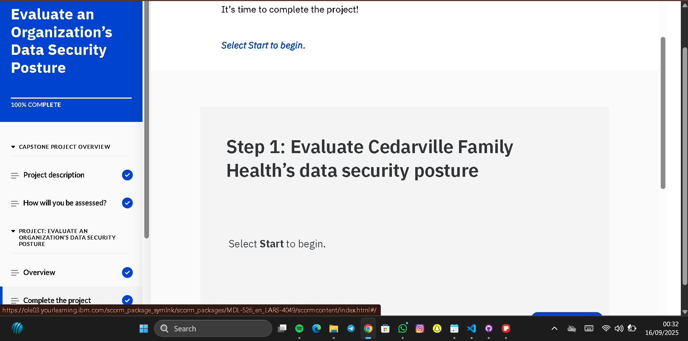
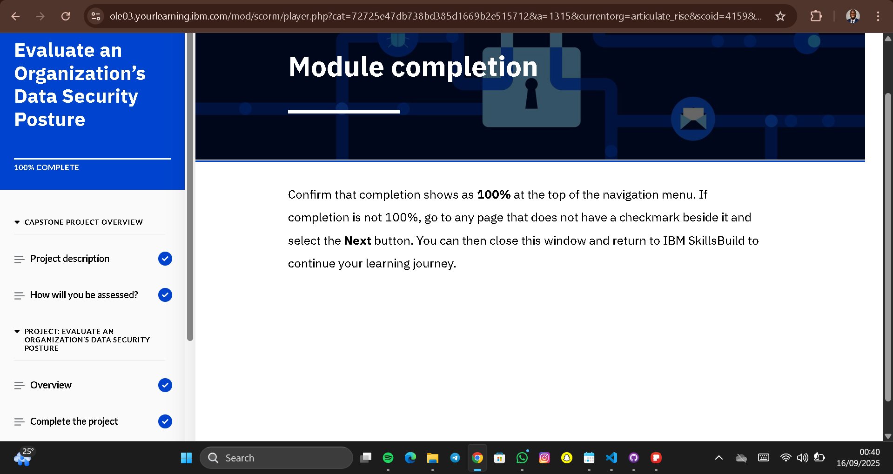
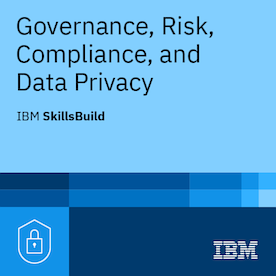

# Backup Plan — Cedarville Family Health
**File:** `backup-plan.md`  
**Project source:** IBM SkillsBuild Capstone — Task 1: Develop a backup plan  
**Prepared by:** Anukwelu Amamchukwu Godson  
**Date:**  16/09/2025  

---

## Plain summary (one line)
I replaced the insecure manual backup process (copying data to a portable HDD carried home in a purse) with a secure, easy-to-follow **3-2-1 backup plan**: three copies of data, stored on two types of media, with one kept offsite.

---

## What the IBM task asked me to do (simple)
- Decide **who** is responsible for backups.  
- Choose **what data** to back up.  
- Select **backup type, frequency, and retention rules**.  
- Plan **where data is stored** (local + offsite).  
- Write **step-by-step implementation** including audits and training.  

---

## My backup plan — clear, practical steps

### Who is responsible?
- **Primary:** IT team support lead (or a contracted managed IT provider).  
- **Secondary:** Office Manager (Sandra) — verify backups completed and keep daily logs.  

**Reason (plain):** Backups need technical setup and testing. An IT person or vendor should configure and maintain backups. Sandra can check daily logs but should not be the only person responsible.  

---

### Data to back up (simple list)
- **Electronic patient records (PHI)**  
- **Billing and invoicing data**  
- **Appointment and administrative files**  
- **Audit logs and system configuration files**  

*(Analogy: Think of these as the clinic’s “lifeblood files.” If lost, the clinic can’t treat patients, get paid, or stay compliant.)*

---

### Backup types & frequency
- **Daily incremental backups** → only changes are saved daily (like saving only the new edits in a notebook instead of rewriting the whole book).  
- **Weekly full backups** → a complete copy of everything once a week.  
- **Monthly snapshots** → longer-term backups for compliance and auditing.  

**Retention (how long we keep them):**  
- Daily incrementals: 30 days  
- Weekly full: 90 days  
- Monthly snapshots: 1 year  

---

### Storage strategy (where backups are kept)
- **Local (on-site):** Encrypted NAS (Network Attached Storage) in a locked cabinet. Used for fast recovery.  
- **Offsite (cloud):** Encrypted cloud backups with a provider that supports **AES-256 encryption** and **key management service (KMS)**. Protects against fire, theft, or flood at the clinic.  

 **Important:** Stop taking portable hard drives home. That exposes PHI and violates HIPAA.  

*(Analogy: A portable HDD is like carrying all patient files in your handbag — if it’s lost, everything is exposed. Cloud + locked NAS is like having a fireproof safe in the clinic **and** a digital vault far away.)*

---

### Implementation steps (step-by-step action plan)
1. **Choose a secure cloud backup provider** that supports server-side encryption (SSE-KMS).  
2. **Set up an encrypted NAS** on-site and place it in a locked cabinet.  
3. **Configure automatic schedules:** daily incrementals + weekly fulls.  
4. **Test restore procedure** once everything is configured.  
5. **Retire manual HDD backups** — securely wipe or destroy unencrypted drives.  
6. **Document backup jobs** and assign Office Manager to verify daily logs.  

---

### Audits, testing & training
- **Monthly:** IT lead runs a restore test from cloud backup.  
- **Quarterly:** Review backup logs and configuration.  
- **Training:** Office Manager trained with a **1-page checklist** on how to verify backups.  

---

## IBM form question inside Task 1
**Question:** Who should be responsible for completing backups?  
**Answer chosen:** *IT team support lead (or contracted IT provider).*  
**Reason:** Backups require technical knowledge, encryption setup, and recovery testing. If the clinic has no IT staff, outsource to a managed IT provider.  

---

## Practical note for a small clinic
If hiring IT isn’t possible right away, choose a **cloud backup product with onboarding and managed support**. This costs a bit more but ensures proper encryption, testing, and compliance without requiring advanced technical skills in-house.  

---

## Screenshot placeholders (to replace later)
Insert screenshots here once you fetch them from IBM SkillsBuild capstone and your backup plan setup:  

---

## Short checklist (for the SkillsBuild form)
- Responsible party: IT team support lead (Office Manager verifies).  
- Backup type: Daily incremental + weekly full + monthly snapshot.  
- Storage: Encrypted NAS (locked) + encrypted cloud (AES-256, SSE-KMS).  
- Testing: Monthly restore test; quarterly audit; staff training.  
