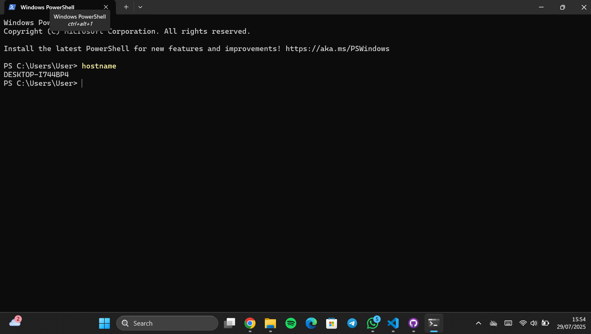
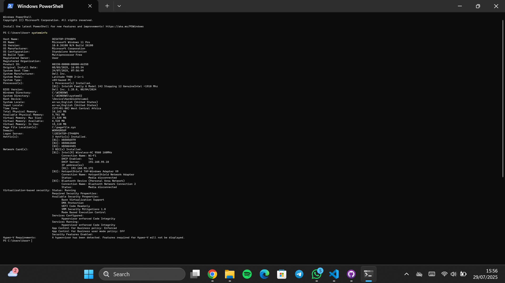
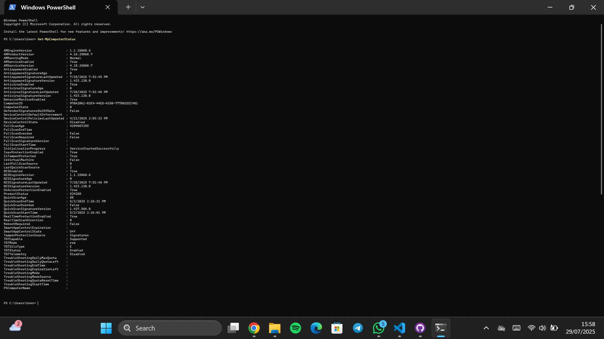

# 🛡 Cybersecurity Module 5: Legal, Ethics & Careers in Cybersecurity

## Project Overview

This project explores the legal and ethical responsibilities of cybersecurity professionals and highlights potential career paths in the field. In addition, it includes a set of system diagnostic commands to assess the status of a Windows machine, confirming user identity, system health, and security configuration.

---

##  System Diagnostics (Windows)

Below are the system commands I ran to demonstrate awareness of user privileges, device status, and security posture.

### 🔹 1. whoami
- *Purpose*: Displays the currently logged-in user account.
- *Why It Matters*: Helps confirm whether the user has admin rights, which is critical when performing sensitive cybersecurity tasks.
- *Output Sample*:  
  DESKTOP-XXXXXXX\Godson

---

### 🔹 2. hostname
- *Purpose*: Shows the device name on the network.
- *Why It Matters*: Useful when identifying systems across a local or organizational network.
- *Output Sample*:  
  DESKTOP-ABCD1234

---

### 🔹 3. systeminfo
- *Purpose*: Displays detailed info about the computer system, including OS version, BIOS, and more.
- *Why It Matters*: Helps assess vulnerabilities, patch status, and system health.
- *Key Insights*:
  - OS: Windows 10 Pro
  - System Manufacturer: [e.g., HP or Dell]
  - Last Boot Time: [recent or outdated]

---

### 🔹 4. Get-MpComputerStatus (PowerShell)
- *Purpose*: Shows Windows Defender's current status.
- *Why It Matters*: Ensures antivirus/antimalware protection is enabled and updated.
- *Sample Checks*:
  - AMServiceEnabled: True
  - AntispywareEnabled: True
  - AntivirusEnabled: True
  - RealTimeProtectionEnabled: True

---

## ⚖ Legal and Ethical Issues in Cybersecurity

Cybersecurity professionals often have access to sensitive systems and data. This makes it essential to act legally and ethically at all times.

###  Key Concepts Covered:
- *Legal Boundaries*: Skills must be used legally, even if you have the ability to hack.
- *Personal Ethics*: “Just because you can doesn’t mean you should.”
- *Corporate Responsibility*: Follow organizational policies and legal guidelines.
- *Case Study Insight*: When a colleague was found responsible for a breach, hiding the result might have seemed harmless, but the ethical choice was to report it.

###  Ethics Checklist Questions:
Ask yourself:
- Is it legal?
- Does it comply with company policy?
- Is it fair to stakeholders?
- Would I be okay if everyone acted this way?
- Would it look good on the front page of a newspaper?

*Bottom line: *What’s legal isn’t always ethical. Ethics requires transparency and responsibility.

---

##  Cybersecurity Certifications

Certifications help validate your skills, boost your profile, and unlock new career levels.

###  Notable Certifications:

| Certification | Description | Experience Required |
|---------------|-------------|---------------------|
| *CCST Cybersecurity* | Beginner-level Cisco cert for high school/college students | None |
| *CompTIA Security+* | Entry-level cert accepted by US govt | Basic IT knowledge |
| *EC-Council CEH* | Learn ethical hacking using hacker tools | Moderate |
| *ISC2 CISSP* | Top-level industry cert with high recognition | 5+ years |
| *Cisco CyberOps Associate* | SOC analyst certification | Foundational |

---

##  Career Pathways in Cybersecurity

There are diverse job roles across the cybersecurity field. Your journey could begin as a *Security Analyst* and grow into a *Cybersecurity Consultant, **SOC Manager, or **Penetration Tester*.

###  Use CyberSeek
CyberSeek provides a visual roadmap of cybersecurity career options. It helps you:
- Explore roles
- See salary ranges
- Understand required skills

*Link*: [CyberSeek Interactive Career Pathway](https://www.cyberseek.org/pathway.html)

---

## Conclusion – What I Learned

This module taught me:
- The difference between legal and ethical behavior in cybersecurity.
- Why transparency and accountability are crucial in this field.
- What certifications will help me move forward in my cybersecurity career.
- The importance of tools like CyberSeek for job research and planning.

---
