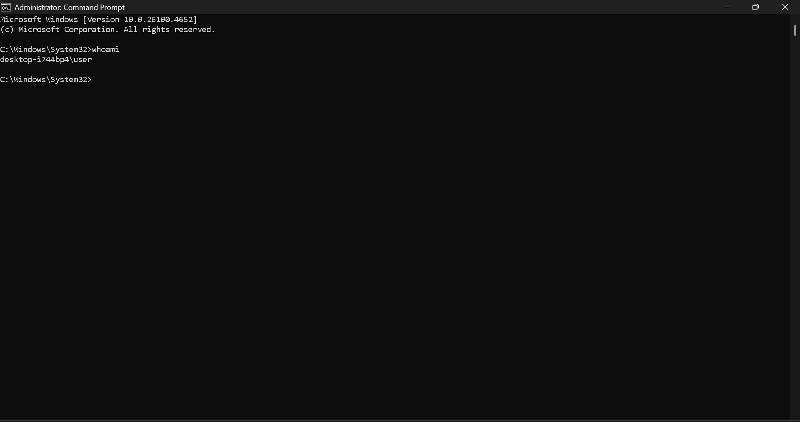
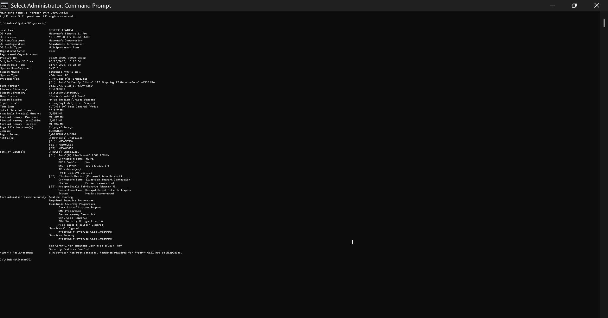

# 🛡 Module 4 Cybersecurity Project – Server Security and Protection (Windows)

## Project Overview

This project is part of the Cisco Cybersecurity Essentials course – *Module 4: Server Security and Protection*.  
It focuses on identifying vulnerabilities and taking actions to secure a *Windows-based machine* using various security and diagnostic tools.

## Step 1: System Diagnostics (Information Gathering)

###  User & Identity Check
- *Command:* whoami  
- *Result:* desktop-i744bp4\user  
- *Insight:* Logged in as a local user account, not domain-joined. Local access level is assumed.

*Screenshot:*  

###  Hostname Verification
- *Command:* hostname  
- *Result:* DESKTOP-I744BP4  
- *Insight:* Device hostname used for network identification.

*Screenshot:*  

---

### System Information Snapshot
- *Command:* systeminfo  
- *Highlights:*
  - OS Name: Windows 11 Pro
  - Device: Dell Latitude 7400 2-in-1
  - Installed RAM: 16 GB (Available: 3.6 GB)
  - Virtual Memory: 21.5 GB in use
  - Time Zone: West Central Africa
  - Last Boot: 11/07/2025, 03:24 AM
  - Installed Hotfixes: KB5056579, KB5062553, KB5063666

- *Insight:* System is up-to-date with security hotfixes, but high RAM/virtual memory usage suggests background load or system strain.

*Screenshot:*  

---

###  Network Configuration Analysis
- *Command:* ipconfig /all  
- *Findings:*
  - IP Address: 192.168.221.172
  - DHCP Enabled: Yes
  - Primary Adapter: Intel(R) Wireless-AC 9560
  - Other Interfaces: HotspotShield TAP (inactive), Bluetooth (inactive)

- *Insight:* Connected to a secure Wi-Fi network. Unused adapters present potential risk if left active without monitoring.

*Screenshot:*  

###  Antivirus & Defender Security Status
- *Command (PowerShell):* Get-MpComputerStatus  
- *Critical Flags:*
  - AntivirusEnabled: False
  - AntispywareEnabled: False
  - AMServiceEnabled: False
  - BehaviorMonitorEnabled: False
  - IoavProtectionEnabled: False

- *Insight:*  
   *Major Security Risk*  
  All core Defender components are disabled. This exposes the system to malware, ransomware, and unauthorized access.

*Screenshot:*  

## ⚠ Risk Assessment Summary

| Component            | Status         | Risk Level 
|----------------------|----------------|------------
| Windows Defender     | Disabled       | ❌ High     
| OS & Hotfixes        | Updated        | ✅ Low      
| RAM Usage            | Heavy Load     | ⚠ Medium   
| Network Adapters     | One Active     | ✅ Low      

## Next Phase (Step 3): Hardening the Windows System

Tasks to complete:
- Enable and configure *Windows Defender*.
- Turn on *Windows Firewall* and verify rules.
- Disable or restrict *unused network interfaces*.
- Run a *full virus scan*.
- Begin *event log monitoring*.

##  Key Lesson Learned

> “A secured system is not just about having antivirus installed, but about understanding your system, eliminating silent threats, and enforcing strict configurations.”

## Author

- *Project by*: Anukwelu Amamchukwu Godson
- *Course*: Cisco Cybersecurity Essentials – Module 4  
- *Platform*: Windows 11  
- *Tools Used*: Command Prompt, PowerShell, Systeminfo, ipconfig, Defender

##  License

This project is for academic purposes under the Cisco Cybersecurity curriculum. All configurations and data reflect personal system diagnostics, not production environments.

